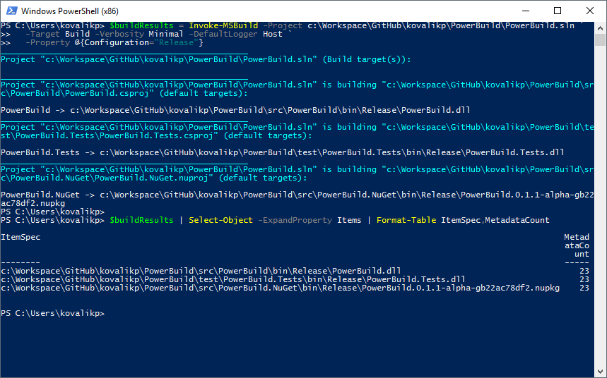

# PowerBuild

[](https://ci.appveyor.com/project/kovalikp/powerbuild/branch/master)

PowerBuild module provides full MSBuild integration into PowerShell pipeline. Unlike simmilar modules that provide wrapper around `msbuild.exe`, PowerBuild's `Invoke-MSBuild` cmdlet uses `Microstft.Build` API directly. It means it can write build results into output, making the results available for processing by other cmdlets. Default logger utilizes Error, Warning and Verbose streams to log MSBuild events.

## Getting started:

You can get the module from the [PowerShell Gallery](https://www.powershellgallery.com/packages/PowerBuild) by executing following script.

```powershell
Install-Module -Name PowerBuild 
```
## Using PowerBuild

Invoke MSBuild and store results to local variable.

```powershell
PS> $buildResults = Invoke-MSBuild -Project c:\Workspace\GitHub\kovalikp\PowerBuild\PowerBuild.sln `
>>   -Target Build -Verbosity Minimal -ConsoleLogger PSHost `
>>   -Property @{Configuration="Release"}
```
Manipulate results in pipeline.

```powershell
PS> $buildResults | Select-Object -ExpandProperty Items | Format-Table ItemSpec,MetadataCount
```

### Supported switches

| CommandLine								| PowerShell |
|-------------------------------------------|---|
| [project file \| directory]				| -Project \<string\>
| /target:\<targets\>						| -Target \<string[]\>
| /property:\<n\>=\<v\>						| -Property \<Hashtable\>
| /property:Configuration=\<v\>				| -Configuration \<string\>
| /property:Platform=\<v\>					| -Platform \<string\>
| /maxcpucount[:n]							| -MaxCpuCount \<int\>
| /toolsversion:\<version\>					| -ToolsVersion \<string\>
| /verbosity:\<level\>						| -Verbosity \<LoggerVerbosity\>
| /consoleloggerparameters:\<parameters\>	| -ConsoleLoggerParameters
| /noconsolelogger							| -ConsoleLogger {None \| Streams \| PSHost}
| /fileLogger[n]							| New-FileLogger
| /fileloggerparameters[n]:\<parameters\>	| New-FileLogger
| /distributedlogger						|
| /distributedFileLogger					|
| /logger:\<logger\>						| -Logger \<ILogger[]\>
| /warnaserror								| -WarningsAsErrors @()
| /warnaserror:code[;code2]					| -WarningsAsErrors \<string[]\>
| /warnasmessage							| -WarningsAsMessages @()
| /warnasmessage:code[;code2]				| -WarningsAsMessages \<string[]\>
| /validate									| 
| /validate:\<schema\>						| 
| /ignoreprojectextensions:\<extensions\>	| -IgnoreProjectExtensions \<string[]\>
| /nodeReuse:\<parameters\>					| -NodeReuse \<bool\> |
| /preprocess								| Invoke-MSBuildPreprocess
| /preprocess:file							| Invoke-MSBuildPreprocess \| Out-File
| /detailedsummary							| -DetailedSummary |
| @\<file\>									|
| /noautoresponse							|
| /nologo									|
| /version									|
| /help										| Get-Help Invoke-MSBuild

### Argument Completers

PovwrBuild provides autocompleters for several arguments. They either use MSBuild API directly, or try to approximate
MSBuild functionality to generate values.

| Parameter		| Solution				| Project				|
|---------------|-------------------	|-----------------------|
| Target		| Approximate MSBuild	| MSBuild API
| Configuration | MSBuild API			| "Debug" or "Release"
| Platform		| MSBuild API			| "AnyCPU", "x64" or "x86"


### Logging

Default logger can be specified using `-ConsoleLogger` parameter. The parameter currently recognized these values.
 - $nulll - If console logger was passed via -Logger parameter, then `None`, else `Streams`.
 - Streams - Uses Error, Warning and Verbose streams to write logs. `-Verbosity` switch affects log level output to Verbose stream.
 - PSHost - Uses PowerShell host to write logs. This is equivalent of msbuild.exe's console logger.
 - None - Disables console logger.
 
Level of logging is affected by `-Verbose` parameter.

Additional loggers can be created using `New-Logger`, `New-ConsoleLogger` or `New-FileLogger` commnandlets and passed to `-Logger` parameter.

### Example


